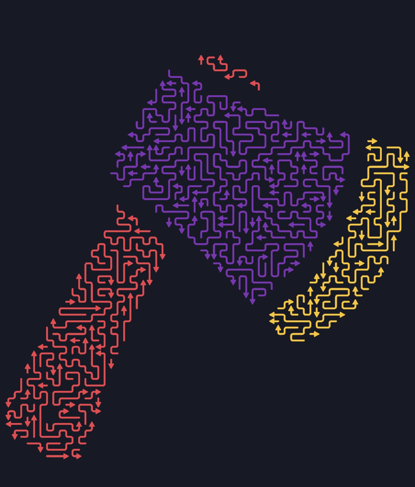

# Arrow Maze

An offline, phone-first puzzle. A silhouette is tiled by one space-filling path
cut into segments, each with an arrowhead at one end. Tap a segment: if the
forward ray from its head to the board edge is clear, it snakes out and leaves
the board. If anything sits on that ray, it bounces and costs a life. Clear
every segment to win.



Proof of concept. Full spec: [`docs/PRD.md`](docs/PRD.md).

## Status

Proof of concept complete. The generator, renderer, game loop, offline build and
tuning panel are all in — read [`docs/VERDICT.md`](docs/VERDICT.md) for what the
PoC settled, what it did not, and the defaults it shipped.

**Live build:** <https://bencan1a.github.io/mazeGame/> — deploys on every push
to `main`. To put a branch on a phone, run the _Deploy to GitHub Pages_ workflow
from the Actions tab and pick it.

## Quick start

```sh
npm install
npm run dev       # dev server
npm run verify    # format + lint + typecheck + tests + coverage
npm run harness   # headless generator sweep (once the generator lands)
npm run shapes    # bake the shape library into public/ (needs the network once)
npm run test:e2e  # playwright browser tests against a real build
npm run dev -- --host   # serve on your LAN, to open on a phone
```

Node 22+.

Service workers need a secure context, so the LAN dev server cannot test
offline or install — use the deployed build for those. See
[`docs/TESTING.md`](docs/TESTING.md).

## Why it is tractable

Removing a segment can only ever _unblock_ others, so the blocking relation is a
static digraph and the puzzle is solvable exactly when that digraph is acyclic.
No search, no dead ends, no undo stack — any greedy order works.

Difficulty is therefore not combinatorial. It is visual search: tracing a long
ray across a dense field and judging whether one thin segment crosses it. The
generator is tuned by measurement, not intuition — see
[`docs/METRICS.md`](docs/METRICS.md).

## Docs

|                                        |                                                                                            |
| -------------------------------------- | ------------------------------------------------------------------------------------------ |
| [Verdict](docs/VERDICT.md)             | What the PoC settled, the shipped defaults, and what a v1 needs                            |
| [PRD](docs/PRD.md)                     | The specification                                                                          |
| [Plan](docs/PLAN.md)                   | Phases, milestones, parallel work streams                                                  |
| [Architecture](docs/ARCHITECTURE.md)   | Module map and the rules the build enforces                                                |
| [Contracts](docs/CONTRACTS.md)         | Interfaces every stream codes against                                                      |
| [Workflow](docs/WORKFLOW.md)           | How one human and several agents share this repo                                           |
| [Metrics](docs/METRICS.md)             | What the tuning harness measures and how to read it                                        |
| [Testing](docs/TESTING.md)             | What CI settles, what needs a real phone, and how to get it there                          |
| [Backlog source](scripts/backlog.json) | Seed data for the issues; run `node scripts/seed-github.mjs --render` for a readable index |
| [ADRs](docs/adr/)                      | Decisions and why the alternatives lost                                                    |

Agents: start with [`CLAUDE.md`](CLAUDE.md).

## License

[MIT](LICENSE)
