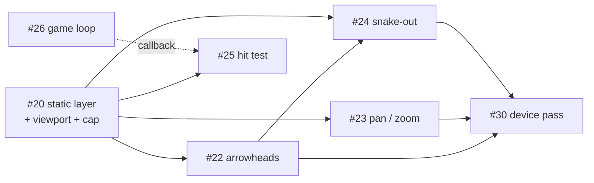

# M3 — Playable: sequencing and parallelism

How the eight M3 issues fit together, what order they must go in, and how many
agents can work at once without colliding.

M3 is greenfield: `src/render/`, `src/game/` and `src/pwa/` do not exist yet.
Everything here builds on a finished `Board` and nothing else — no stream in M3
reaches into the generator's intermediate stages.

---

## 1. The issues

| #      | Title                                   | Lane          | Primary files                  |
| ------ | --------------------------------------- | ------------- | ------------------------------ |
| 20     | Two-layer canvas renderer               | S5 render     | `src/render/**`                |
| 22     | Arrowheads and legibility floor         | S5 render     | `src/render/**`                |
| 23     | Pan and zoom                            | S5 render     | `src/render/**`, pointer input |
| 24     | Snake-out exit animation                | S5 render     | `src/render/**`                |
| 25     | Hit testing and free-segment tap radius | S6 app        | `src/game/**`                  |
| 26     | Game loop: queue, bounce, lives, win    | S6 app        | `src/game/**`                  |
| ~~21~~ | ~~Automated browser tests~~             | S7 infra      | **deferred to M4** — see §6.1  |
| 30     | Device performance pass (G3 gate)       | S5 + hardware | `docs/**`, issue comments      |

---

## 2. Dependency graph

Solid arrows are hard blocks. The dashed arrow is a soft one — see §3.3.

**Critical path: #20 → #22 → #24 → device session.** Four stages. Everything
else fits inside it.

---

## 3. Seams to agree before anyone writes code

These are the four places where two issues touch the same thing. Each has to be
settled up front, because discovering the disagreement at merge time costs the
whole wave.

### 3.1 The viewport transform has one owner: #20

`#23` needs cell → pixel to blit. `#25` needs pixel → cell to hit-test. `#22`
needs cells-per-CSS-px to know whether an arrowhead is legible. If each writes
its own, they will disagree about device pixel ratio and rounding, and the
first symptom will be taps landing one cell off at some zoom levels.

**#20 ships `src/render/viewport.ts` as part of its deliverable**, exporting
both directions plus the current scale. It is in S5's lane, so S6 imports it
rather than reimplementing — that is a one-way dependency, not a contract change.

### 3.2 Pointer events need a single arbiter — decision required

`#23` (pan/zoom drag, S5) and `#25`/`#26` (tap, S6) both want listeners on the
same canvas element. Two independent listener sets means a drag that ends near a
segment also fires a tap, which costs a life the player did not choose to risk —
the exact failure `#25` exists to prevent.

**Decided: S6 owns every pointer listener**, in `src/game/input.ts`. It
classifies a gesture as drag, pinch or tap and calls into the S5 viewport for the
first two. `#23` is labelled `stream:render` and still owns the viewport maths —
zoom clamping, pan bounds, the blit — but its gesture handling lands in S6's file
so there is exactly one place that decides a drag is not a tap.

### 3.3 #25 takes `isFree` as a callback, so #26 is not a blocker

`#25` must snap only to _free_ segments, and free-ness is derived from the
removed-set that `#26` owns. Passing a `(id: SegmentId) => boolean` predicate in
keeps the two issues genuinely concurrent and keeps the hit test unit-testable
against a fixture board with no game state at all.

### 3.4 The canvas cap is 8192² per canvas, and allocation never throws

From the closed spike (#19, measured on iPhone / iOS 18.7):

- The limit is **per canvas, not a total memory budget.** Two 8192² buffers
  (512 MB) held; one 10000² buffer (381 MB) did not.
- **Cap any single canvas at 8192².** At 100×100 that is 27 CSS px per cell at
  dpr 3 — well clear of the ~8–10 CSS px arrowhead floor `#22` is scoped around,
  so memory does not constrain legibility at the largest grid.
- An over-budget canvas **comes back blank and silent** rather than raising.
  Only reading a drawn pixel back detects it. `#20` must probe, not trust.
- A screen-sized animation layer is the recommended default (14 MB vs 256 MB).
- Untested: any Android device, and a soak run holding 512 MB of painted content.

> These findings live only in the comments on #19 — they are **not** in
> `CLAUDE.md` or `docs/PRD.md`, contrary to that issue's closing note. Worth
> landing them in `CLAUDE.md` under known traps so `#20` does not have to find
> a closed issue.

---

## 4. The wave plan

### Wave A — 2 agents, nothing blocks anything

| Track | Issue | Notes                                                                                     |
| ----- | ----- | ----------------------------------------------------------------------------------------- |
| S5    | #20   | **Critical path.** Static layer, `viewport.ts`, buffer cap with pixel-readback probe.     |
| S6    | #26   | Headless state machine against a fixture board. Zero renderer dependency — start day one. |

`#26` is the one M3 issue with no dependency on anything in M3 at all. Its own
acceptance criteria require it to be testable "with no canvas", which is what
makes it safe to run first.

### Wave B — 3 agents, needs #20 merged

| Track | Issue | Notes                                                                |
| ----- | ----- | -------------------------------------------------------------------- |
| S5    | #22   | Arrowheads, rounded joins, palette. Owns the segment draw routine.   |
| S5    | #23   | Pan/zoom. Owns the viewport and gesture code — not the draw routine. |
| S6    | #25   | Hit test. Imports #20's inverse transform; takes `isFree` per §3.3.  |

`#22` and `#23` are both S5 but touch disjoint files (see §5), so they run
concurrently.

### Wave C — 1 agent, needs Wave B

| Track | Issue | Notes                                                                          |
| ----- | ----- | ------------------------------------------------------------------------------ |
| S5    | #24   | Snake-out. Animates the same polyline `#22` draws — sequential after #22 only. |

`#24` does not depend on `#23`. If pan/zoom slips, the animation still lands.

### Wave D — human, on hardware, one session

`#30`, plus the device-measured criteria inside `#22` and `#23`. See §6.

**Maximum useful concurrency is 3 agents**, in Wave B. A fourth has nothing to
claim in any wave.

---

## 5. File split, so concurrent branches do not collide

| File                     | Created by | Later touched by                     |
| ------------------------ | ---------- | ------------------------------------ |
| `src/render/viewport.ts` | #20        | #23 (zoom clamp, pan bounds)         |
| `src/render/layers.ts`   | #20        | —                                    |
| `src/render/draw.ts`     | #20 (stub) | #22 (fills it), #24 (reads it)       |
| `src/render/palette.ts`  | #22        | —                                    |
| `src/render/animate.ts`  | #24        | —                                    |
| `src/render/index.ts`    | #20        | every wave appends — **barrel only** |
| `src/game/state.ts`      | #26        | —                                    |
| `src/game/hitTest.ts`    | #25        | —                                    |
| `src/game/input.ts`      | #25        | #23 (per §3.2)                       |

`src/render/index.ts` is the one guaranteed merge hotspot. Keeping it a pure
re-export barrel with no logic makes every conflict a trivial one.

---

## 6. Scope decisions taken

Both of these were settled before Wave A started, rather than discovered at the
milestone review.

### 6.1 #21 moved to M4 — browser tests

Four of its acceptance criteria — service worker, offline second load,
manifest/scope/`start_url`, and persistence across reload — test features that
are **M4 issues (#27, #28, #29) and do not exist yet**. Left in M3, the milestone
would have closed with #21 open no matter how much work went into it.

**Moved to M4 / `wave:4`, sequenced beside #29.** The two M3-behaviour criteria
in it — hit testing and the game-loop transitions — stay on the issue rather than
being split out: they cost nothing extra once the Playwright runner exists, and
#25 and #26 will have landed long before it starts.

The cost of deferring is that M3 lands with no browser-level regression test.
The mitigation is that #25 and #26 are both required to be unit-testable
headlessly — #26 explicitly "with no canvas" — so the behaviour most likely to
regress is covered by vitest inside M3 regardless.

### 6.2 The device criteria are batched into one session

Three issues carry criteria only a phone can satisfy:

- `#22` — "measured minimum legible size on a real phone, recorded in the issue"
- `#23` — "60fps on a real phone at 100×100 — measured, not assumed"
- `#30` — generation time, frame rate, peak memory, and forcing the buffer cap

CI cannot produce any of these (`docs/TESTING.md`), and a number from a headless
Linux runner is not evidence about a phone.

**One device session at the end of Wave C closes all three.** They need identical
setup — the deployed build, a 100×100 board, and the device model and OS version
recorded — so running them separately pays that cost three times. `#30` also
requires that results from different hardware not be combined, which batching
enforces for free.

If `#30` misses a target, the fallback is a **recorded decision** to lower the
maximum grid size, not a silent default. That is the one M3 outcome that can
force an architecture change rather than a tuning change, which is why it sits at
the end of M3 rather than in M4.

---

## 7. Status

| Wave | Issues        | State                             |
| ---- | ------------- | --------------------------------- |
| A    | #20, #26      | in progress                       |
| B    | #22, #23, #25 | blocked on #20                    |
| C    | #24           | blocked on #22                    |
| D    | #30 (+22, 23) | blocked on C — one device session |

Deferred to M4: #21.
